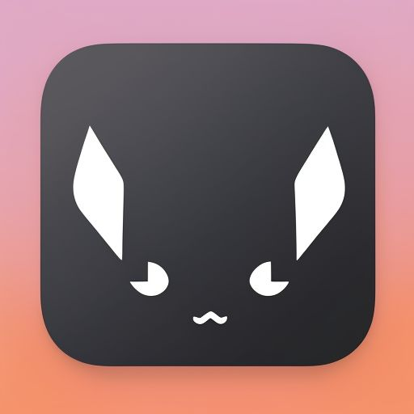
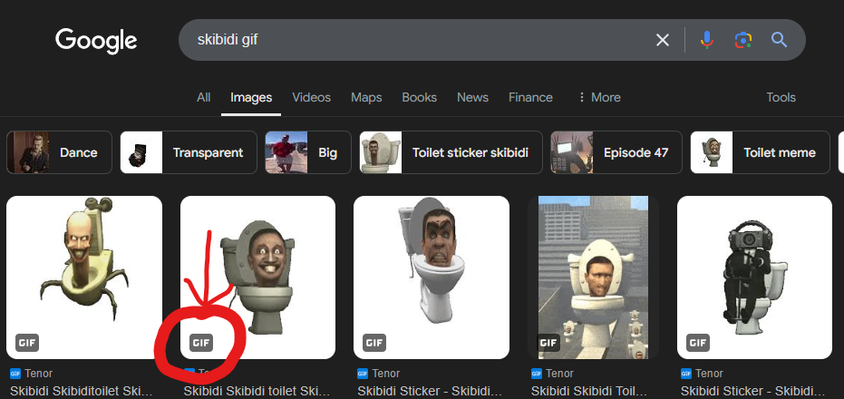
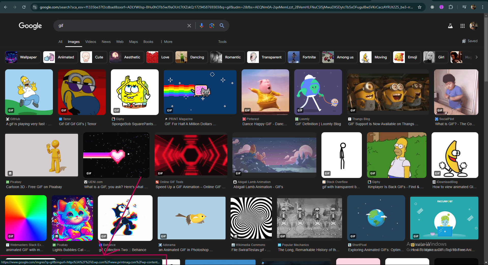
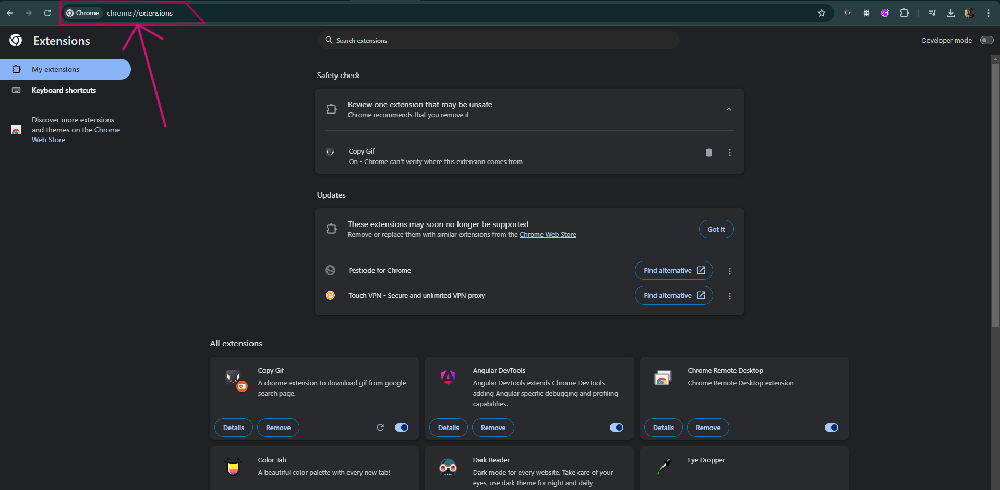
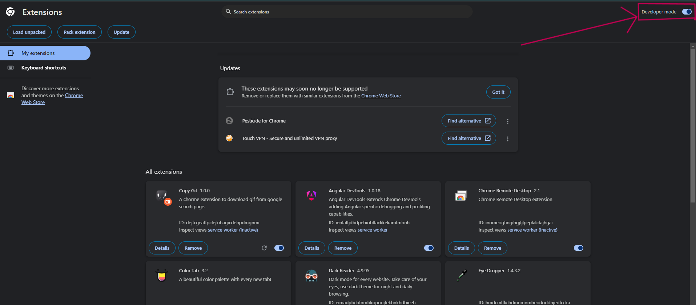
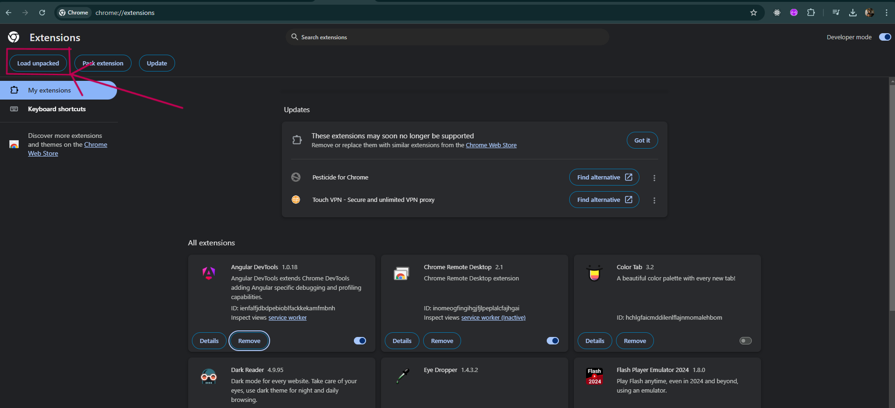
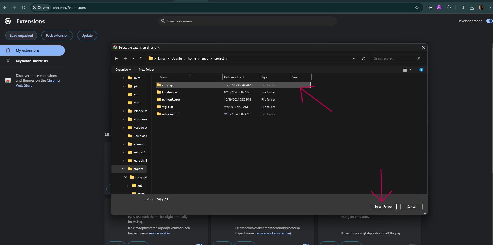
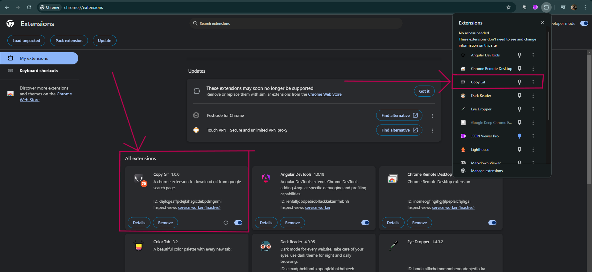

<h1 align="center">
  <br>
  <a href=""></a>
  <br>
 Copy Gif
  <br>
</h1>
<h4 align="center" style="color:#e74c3c">A chrome extension to download gif from google search page<h4>

# Demo


## Limitations

### :red_circle:**`Just like the demo only gif with written "GIF" on the bottom will download.`**



### :red_circle:**`When you hover on the "GIF" icon notice on the bottom a link load if the link is not fully loaded wait a second to load then click to download, it happens only when we just open the search page the reason is to load the extension`**

<details>
<summary>
<b>Unloaded Link example</b>
</summary>

</details>

<details>
<summary><b>Loaded Link example</b></summary>

</details>

### :red_circle:**`The extension is not available on the chrome extension store because I don't have any developer account so we have to use it through cloning`**

# How To Use

## 1. Clone

#### Clone this repository and remember where you cloned the project

```bash
$ git clone https://github.com/znydd/copy-gif
```

## 2. Load extension

- ### **Open Google Chrome**
- ### **Type `chrome://extensions` on the address bar to open extension manager like below ss**
  
- ### **Now toggle the Developer Mode option on the right upper corner to active Developer Mode**

  

- ### **Now click on the Load Unpacked**
  
- ### **After pressing on `Load Unpacked` it will ask you to choose a folder and now you will choose the cloned folder named `copy-gif`**

  

- ### **Finally the extension should be loaded like below**

  

## Support

## `Give a Star to the repo`

## License

MIT

---

> X(Twitter) [@znyd_x](https://x.com/znyd_x)
